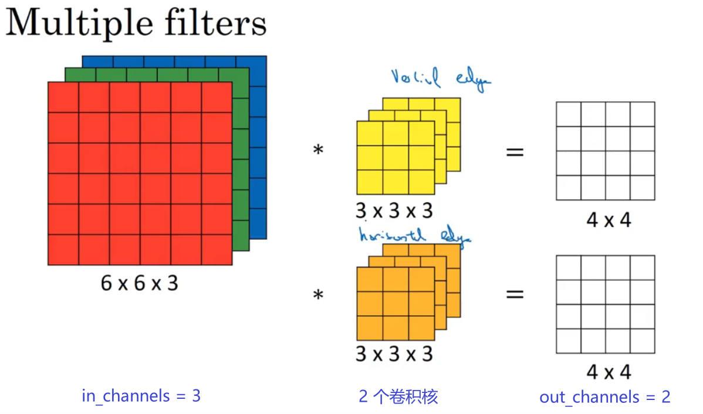

> 视频教程：[【小土堆】Pytorch](https://www.bilibili.com/video/BV1hE411t7RN)

# 零、常用快捷键

ctrl + P 查看需要填什么参数。

鼠标点击名称然后 alt+enter 可以快速导入要用的库。

# 一、(P4) dir() 和 help()

`dir()` 函数，能让我们知道工具箱以及工具箱中的分隔区有什么东西。

`help()` 函数，能让我们知道每个工具是如何使用的，工具的使用方法。

示例：

```python
dir(torch.utils.data.DataLoader)

'''输出：
['_DataLoader__initialized',
 '__annotations__',
 '__class__',
 '__class_getitem__',
 '__delattr__',
	 ...
 '_index_sampler',
 '_is_protocol',
 'check_worker_number_rationality',
 'multiprocessing_context']
 '''
```

```python
help(torch.cuda.is_available)

'''输出：
Help on function is_available in module torch.cuda:
is_available() -> bool
    Returns a bool indicating if CUDA is currently available.
'''
```

# 二、(P6-P7, P15) PyTorch 加载数据

蚂蚁蜜蜂分类数据集：[下载链接](https://download.pytorch.org/tutorial/hymenoptera_data.zip) 。

自定义数据集，需要通过继承 `torch.utils.data.Dataset` 来创建自己的类。

类方法必须重写 `__getitem__`，来读取单个 img 及其 label。

`__getitem__` 是魔法方法，当在类的实例后附加索引，会自动调用该方法。

`DataLoader` 是批量加载数据用的 (代码见P15)，它会根据 batchsize 的大小，把数据进行打包，并返回一个迭代器，通过 for 循环遍历此迭代器，可以获得每个 batchsize 的数据，数据通常是**四维的张量**，相当于在图像的三通道前，加了一个 batchsize 通道，例如当 batchsize=64 时：

```python
test_data = torchvision.datasets.CIFAR10("../dataset2", train=False, transform=torchvision.transforms.ToTensor())
test_loader = DataLoader(dataset=test_data, batch_size=64, shuffle=True, num_workers=0, drop_last=False)

for data in test_loader:
    imgs, targets = data  # imgs是64张图片压缩成的[64,_,_,_]的tensor, target是对应的标签
```

# 三、(P8-P9) Tensorboard 的使用

在命令行输入以下内容来打开 tensorboard (logs 是日志文件夹)：

```shell
tensorboard --logdir=logs
```

tensorboard 默认使用 6006 端口，若被占用，使用以下命令指定端口，如 6007：

```shell
tensorboard --logdir=logs --port=6007
```

# 四、(P16-P21) torch.nn 中各种网络层的使用

> 官方文档：[torch.nn — PyTorch 2.1 documentation](https://pytorch.org/docs/stable/nn.html)

## 4.1 Conv2d

[torch.nn.Conv2d](https://pytorch.org/docs/stable/generated/torch.nn.Conv2d.html#torch.nn.Conv2d) 和 [torch.nn.functional.conv2d](https://pytorch.org/docs/stable/generated/torch.nn.functional.conv2d.html#torch.nn.functional.conv2d) 区别在于，前者是继承于 nn.Module 的类，封装的更好，后者是单纯的函数。简而言之，前者是「卷积层」，可以作为神经网络中的模块层，而后者只是「卷积操作」。

关于卷积的 padding, stride, dilation 等操作，可以看 [这篇文档](https://github.com/vdumoulin/conv_arithmetic/blob/master/README.md) 。

数据经过卷积层后，**通道数、尺寸**可能会发生改变，下面对此进行解释：

卷积层的 in_channels 代表输入的通道数，out_channels 代表输出的通道数。如下图所示，out_channels 数值上等于卷积层中**卷积核的数量**，卷积层中每个卷积核的层数和 in_channels 相等，从而用 1 个卷积核对输入进行卷积可以得到 1 层 (channel) 的输出，如下图所示：




图像经过卷积层后的输出尺寸公式为：$out\_size=\frac{n-k+2p}{s}+1$，如果计算结果不为整数则舍弃掉小数部分（即向下取整），参数说明如下：

- n：输入图像的尺寸（边长，输入总是正方形）
- k：卷积核的尺寸
- p：padding 扩充的像素长度，=1 往外扩充 1 圈，=2 往外扩充 2 圈，以此类推
- s：stride，即步长

> 快速判断输出尺寸的小技巧：当 padding = kernel_size / 2 (整除) 时，如果 stride = s，则数据的尺寸就会缩小到原来的 1/s。

当考虑到 dilation 时，输出尺寸的计算公式变为：$out\_size=\frac{n-d\times(k-1)+2p-1}{s}+1$，d 为 dilation 的值，当不等于 1 时，可采用这个公式。或者可以先换算 dilation 后的卷积核尺寸 $K=k+(k-1)\times (d-1)=d\times(k-1)+1$，然后 $out\_size=\frac{n-K+2p}{s}+1$，注意下图中 dilation = 2 （=1表示无dilation）：


## 4.2 MaxPool2d

[MaxPool2d](https://pytorch.org/docs/stable/generated/torch.nn.MaxPool2d.html#torch.nn.MaxPool2d) 默认的步长 stride 和 kernel_size 相同，其中需要注意 ceil_mode 的设置，当为 True 时，会保留池化核超出图像边界的情况：


数据经过池化层后，通道数不会改变，**尺寸**会发生改变，和卷积层的公式一样，输出尺寸公式为：$out\_size=\frac{n-k+2p}{s}+1$，如果计算结果不为整数则舍弃掉小数部分（即向下取整），参数说明如下：

- n：输入图像的尺寸（边长，输入总是正方形）
- k：池化核的尺寸
- p：padding 扩充的像素长度，=1 往外扩充 1 圈，=2 往外扩充 2 圈，以此类推
- s：stride，即步长

## 4.3 ReLU

非线性变化用于增强模型的泛化能力，使得模型可以拟合各种复杂曲线。

ReLU 中的 inplace 参数表示是否原地修改。

## 4.4 Linear 全连接层

[Linear](https://pytorch.org/docs/stable/generated/torch.nn.Linear.html#torch.nn.Linear) 即全连接层，进行的操作是线性变换 $o = wx^T+b$，主要功能是改变输出维数，例如下图，将 4 维变为 3 维：


# 五、(P22) Sequential

[Sequential](https://pytorch.org/docs/stable/generated/torch.nn.Sequential.html#torch.nn.Sequential) 可以把 conv2d、maxpool2d、relu、linear 这些网络层组合在一起，形成一个网络层组合。

尝试实现以下网络模型 (CIFAR10)：


使用 tensorborad 可视化网络：

```python
writer.add_graph(网络模型实例, 网络的输入)
```


# 六、(P23) 损失函数与反向传播

所有的常用 Loss：[loss-functions](https://pytorch.org/docs/stable/nn.html#loss-functions) 。

[L1Loss](https://pytorch.org/docs/stable/generated/torch.nn.L1Loss.html#torch.nn.L1Loss) ：$l_n=|x_n-y_n|$，$L = (l_1 + l_2 +... + l_n) / n$ 或 $L = l_1 + l_2 +... + l_n$
[MSELoss](https://pytorch.org/docs/stable/generated/torch.nn.MSELoss.html#torch.nn.MSELoss)：$l_n=(x_n-y_n)^2$，$L$ 的计算方式核 L1Loss 同理 (取平均或求和)

[CrossEntropyLoss](https://pytorch.org/docs/stable/generated/torch.nn.CrossEntropyLoss.html#torch.nn.CrossEntropyLoss)在**分类问题**中常用，计算公式比较复杂：

$loss(x,class)=-log(\frac{exp(x[class])}{\sum_jexp(x[j])})=-x[class]+log(\sum_jexp(x[j]))$

以下面的的分类为例：


其 $x(即output)=[0.1,0.2,0.4,0.3]$，$class(即Target) = 2 (表示Dog)$，所以：

$ loss(x,class)=-0.4+log(exp(0.1)+exp(0.2)+exp(0.4)+exp(0.3))$

想要 loss 尽量小，那么就需要 $x[class]$ 尽量大（让 target 的概率尽量大），且 $\sum_jexp(x[j])$ 尽量小。

# 七、(P24) 优化器

> 官方文档：[torch.optim — PyTorch 2.1 documentation](https://pytorch.org/docs/stable/optim.html)

优化器的作用在于让网络的参数**往正确的方向更新合适的大小**。

在 PyTorch 中，`backward()` 用于计算梯度，`optim.step()` 用于根据梯度更新网络参数 (卷积核的参数等等)：

```python
optim.zero_grad()  # 梯度归零  
result_loss.backward()  # 计算梯度  
optim.step()  # 进行参数优化
```

PyTorch 优化器代码中要放入**模型的参数**，以及学习率等其他超参数：

```python
optimizer = optim.SGD(model.parameters(), lr=0.01, momentum=0.9)
# model.parameters() 获取模型的参数
```

# 八、(P25) 现有网络模型的使用及修改

> 官方文档：[torchvision.models](https://pytorch.org/vision/stable/models.html#classification)

修改网络模型的两种方式：add_module和使用索引。

网络通常分成多个模块，每个模块再由子模块，或者由普通的 conv, pool 等层构成，以 vgg16 为例，其具有三个层次：最顶层就是整个网络(vgg16)，然后往下是几个模块(比如vgg16的最后一个模块的名称是classifier)，最后是具体的网络层(比如classifier就由 conv, pool, linear 等层构成)。以下列出了vgg16的网络层次：

```
VGG(
  (features): Sequential(
    (0): Conv2d(3, 64, kernel_size=(3, 3), stride=(1, 1), padding=(1, 1))
    (1): ReLU(inplace=True)
    (2): Conv2d(64, 64, kernel_size=(3, 3), stride=(1, 1), padding=(1, 1))
    (3): ReLU(inplace=True)
    (4): MaxPool2d(kernel_size=2, stride=2, padding=0, dilation=1, ceil_mode=False)
    (5): Conv2d(64, 128, kernel_size=(3, 3), stride=(1, 1), padding=(1, 1))
    (6): ReLU(inplace=True)
    (7): Conv2d(128, 128, kernel_size=(3, 3), stride=(1, 1), padding=(1, 1))
    (8): ReLU(inplace=True)
    (9): MaxPool2d(kernel_size=2, stride=2, padding=0, dilation=1, ceil_mode=False)
    (10): Conv2d(128, 256, kernel_size=(3, 3), stride=(1, 1), padding=(1, 1))
    (11): ReLU(inplace=True)
    (12): Conv2d(256, 256, kernel_size=(3, 3), stride=(1, 1), padding=(1, 1))
    (13): ReLU(inplace=True)
    (14): Conv2d(256, 256, kernel_size=(3, 3), stride=(1, 1), padding=(1, 1))
    (15): ReLU(inplace=True)
    (16): MaxPool2d(kernel_size=2, stride=2, padding=0, dilation=1, ceil_mode=False)
    (17): Conv2d(256, 512, kernel_size=(3, 3), stride=(1, 1), padding=(1, 1))
    (18): ReLU(inplace=True)
    (19): Conv2d(512, 512, kernel_size=(3, 3), stride=(1, 1), padding=(1, 1))
    (20): ReLU(inplace=True)
    (21): Conv2d(512, 512, kernel_size=(3, 3), stride=(1, 1), padding=(1, 1))
    (22): ReLU(inplace=True)
    (23): MaxPool2d(kernel_size=2, stride=2, padding=0, dilation=1, ceil_mode=False)
    (24): Conv2d(512, 512, kernel_size=(3, 3), stride=(1, 1), padding=(1, 1))
    (25): ReLU(inplace=True)
    (26): Conv2d(512, 512, kernel_size=(3, 3), stride=(1, 1), padding=(1, 1))
    (27): ReLU(inplace=True)
    (28): Conv2d(512, 512, kernel_size=(3, 3), stride=(1, 1), padding=(1, 1))
    (29): ReLU(inplace=True)
    (30): MaxPool2d(kernel_size=2, stride=2, padding=0, dilation=1, ceil_mode=False)
  )
  (avgpool): AdaptiveAvgPool2d(output_size=(7, 7))
  (classifier): Sequential(
    (0): Linear(in_features=25088, out_features=4096, bias=True)
    (1): ReLU(inplace=True)
    (2): Dropout(p=0.5, inplace=False)
    (3): Linear(in_features=4096, out_features=4096, bias=True)
    (4): ReLU(inplace=True)
    (5): Dropout(p=0.5, inplace=False)
    (6): Linear(in_features=4096, out_features=1000, bias=True)
  )
)
```


vgg16最后一层，是classifier的第7层(索引为6)，是Linear(in_features=4096, out_features=1000, bias=True)，可以通过以下方式，在classifier模块下增加一个全连接层：

```python
vgg16_true.classifier.add_module('add_linear', nn.Linear(1000, 10))
```

也可以通过索引号修改classifer的第6层：

```python
vgg16_false.classifier[6] = nn.Linear(4096, 10)
```

# 九、(P26) 网络模型的保存与读取

保存和读取都有两种方式：

- 方式1：保存/读取模型+参数
- 方式2：保存/读取参数

其中方式1存在一个小陷阱，就是读取pth模型的那个文件，需要引入模型的类的定义，否则会报错。

# 十、(P27-P29) 完整的模型训练套路

以 CIFAR10 数据集为例，网络模型如下：
![[Pasted image 20231108203912.png]]

## 10.1 完整训练套路

1. 准备数据集
2. 用 Dataloader 加载数据集
3. 定义模型的类(class)，创建模型的实例
4. 定义损失函数，并创建对应的实例
5. 设置优化器参数
6. 设置一些其他参数：训练的轮数、一些用于打印日志的 (训练的次数...)
7. 开始训练

```python
# 7. 开始训练  
for i in range(epoch):  
    print("--------第{}轮训练开始--------".format(i+1))  
    # 训练步骤开始  
    for data in train_dataloader:  # 从dataloader中取数据  
        imgs, targets = data  # 获取一个batchsize大小的imgs和targets  
        outputs = tudui(imgs)  # imgs经过网络得到输出  
        loss = loss_fn(outputs, targets)  # 用输出和targets来计算loss  
  
        # 优化器优化模型  
        optimizer.zero_grad()  # 梯度清零  
        loss.backward()  # 计算梯度  
        optimizer.step()  # 根据梯度优化网络参数  
  
        # 打印日志  
        total_train_step = total_train_step + 1  # 训练次数+1  
        print("训练次数:{}, Loss:{}".format(total_train_step, loss.item()))  # .item()会把tensor类型的数字转换为对应的整型或浮点型
```

## 10.2 补充一些细节问题

很多代码会在训练步骤开始前，加上一句 `model.train()`，在验证步骤开始前加上 `model.eval()`。

[train()](https://pytorch.org/docs/stable/generated/torch.nn.Module.html#torch.nn.Module.train)，[eval()](https://pytorch.org/docs/stable/generated/torch.nn.Module.html#torch.nn.Module.eval)：这只对某些模块有任何影响。如果受到影响，请参阅特定模块的文档，了解其在培训/评估模式下的行为细节，例如 Dropout、BatchNorm 等。

所以当你的网络里有这些层时，记得要调用这两句代码。

# 十一、(P30-P31) 利用 GPU 训练

若使用 GPU 训练，只需要在上一节的基础上，额外在以下 3 个地方加上 `.cuda()`：

- 网络模型：`model = model.cuda()`，或者 `model.cuda()`
- 数据 (输入、标注)：`imgs = imgs.cuda()`、`targets = targets.cuda()`
- 损失函数：`loss_fn = loss_fn.cuda()`，或者 `loss_fn.cuda()`

> 可以在变量后面加 .cuda 看看会不会有自动补全提示

或者，先定义 device：

```python
device = torch.device("cuda" if torch.cuda.is_available() else "cpu")
```

然后，将上面的 `.cuda()` 全部换成 `.to(device)`：

- 网络模型：`model = model.to(device)`，或者 `model.to(device)`
- 数据 (输入、标注)：`imgs = imgs.to(device)`、`targets = targets.to(device)`
- 损失函数：`loss_fn = loss_fn.to(device)`，或者 `loss_fn.to(device)`

若主机上有多张显卡，可以指定显卡的序号，比如指定第 2 张显卡：

```python
device = torch.device("cuda:1")
```

# 十二、(P32) 完整的模型验证套路

想查看 CIFAR10 数据集的标签，在 P27-P28 完整的模型训练套路的代码上，此处打上断点：


然后 debug，在 class_to_idx 里可以看到标签：


如果是在gpu上训练的模型，要在cpu上测试，需要加上map_location：

```python
model = torch.load("tudui_49.pth", map_location=torch.device('cpu'))
```

输入单个图片进行测试，此时要记得 reshape 图片，增加一个 1 维的 batchsize：

```python
image = torch.reshape(image, (1, 3, 32, 32))
```
